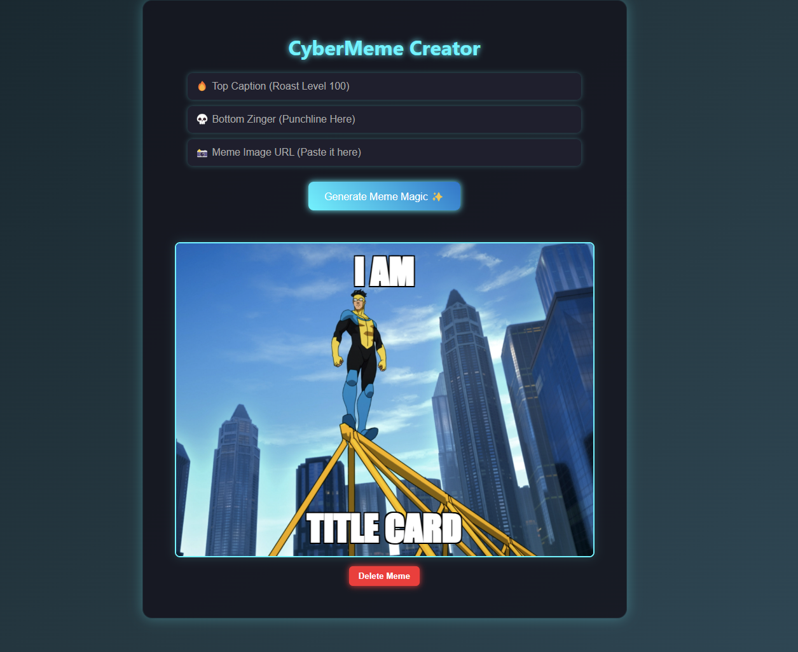

# Neon Meme Machine 🔮

A futuristic meme generator built using HTML, CSS, and vanilla JavaScript.

## 💡 Features
- Add top and bottom text to any image
- Delete memes individually
- Clean, glowing cyberpunk-style UI
- 100% vanilla JS — no frameworks

## 🚀 How to Use
1. Enter top and bottom meme text.
2. Paste an image URL.
3. Click **"Generate Meme Magic ✨"** to create your meme.
4. Click **"Delete Meme"** to remove any meme.

## 📂 Technologies
- HTML5
- CSS3 (with futuristic theme)
- JavaScript 
  
## 🌐 Live Demo

👉 [Click here to try the Neon Meme Machine](https://eskinder185.github.io/neon-meme-machine/)

## 🖼️ Screenshot

Here's a preview of the CyberMeme Creator in action:

Made with 💙 by Eskinder Kassahun
